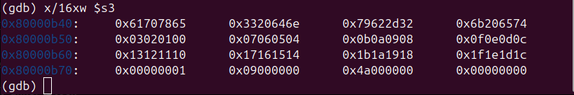
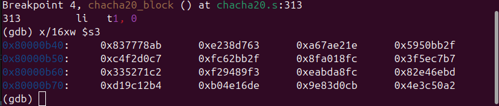
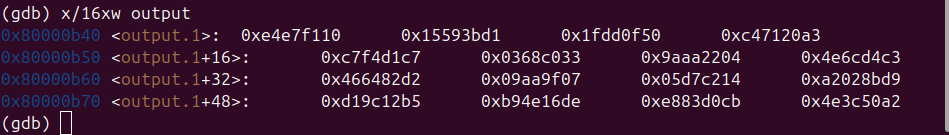
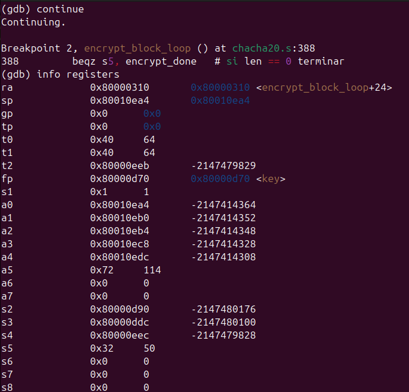
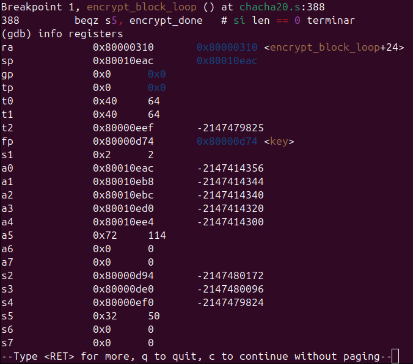

# Documentación Técnica — ChaCha20 en Ensamblador RISC-V

---

## 1. Arquitectura del software

### 1.1 Capas del sistema

El proyecto está organizado en tres capas claramente separadas:

```
┌──────────────────────────────────────────────────────┐
│                   main.c (C)                         │
│  · Vectores de prueba del RFC 8439                   │
│  · Framework de tests (check / uart_puts)            │
│  · Invoca las funciones de ensamblador               │
└────────────────────┬─────────────────────────────────┘
                     │  llamadas C → ensamblador
                     │  (ABI RISC-V ilp32)
┌────────────────────▼─────────────────────────────────┐
│               chacha20.s (RISC-V ASM)                │
│  · chacha20_quarter_round                            │
│  · inner_block  (helper interno)                     │
│  · chacha20_block                                    │
│  · chacha20_encrypt                                  │
└────────────────────┬─────────────────────────────────┘
                     │
┌────────────────────▼─────────────────────────────────┐
│              startup.s + linker.ld                   │
│  · _start: inicializa sp y llama main                │
│  · Carga en 0x80000000 (reset vector QEMU virt)      │
│  · Stack: 64 KB por encima de .bss                   │
└──────────────────────────────────────────────────────┘
```

### 1.2 Interfaces definidas

Todas las funciones están declaradas en `main.c` como `extern` con su prototipo C explícito, y definidas como `.globl` en `chacha20.s`.

| Función | Prototipo C |
|---|---|
| `chacha20_quarter_round` | `void chacha20_quarter_round(uint32_t *state, int x, int y, int z, int w)` |
| `chacha20_block` | `void chacha20_block(const uint32_t *key, uint32_t counter, const uint32_t *nonce, uint32_t *output)` |
| `chacha20_encrypt` | `void chacha20_encrypt(const uint32_t *key, uint32_t counter, const uint32_t *nonce, const uint8_t *plaintext, uint8_t *ciphertext, uint32_t len)` |

`inner_block` es una función auxiliar interna usada únicamente por `chacha20_block`. También se exporta como `.globl` para permitir colocar breakpoints de GDB directamente.

### 1.3 Justificación de decisiones de diseño

**a) Estado en memoria, no en registros**

El estado de ChaCha20 tiene 16 palabras × 4 bytes = **512 bits**. RISC-V tiene 32 registros de propósito general de 32 bits. Mantener las 16 palabras activas más todos los temporales de operación excedería los registros disponibles. La solución adoptada es mantener el estado en un buffer en memoria (apuntado por un registro callee-saved `s3` en `chacha20_block`) y cargar solo las 4 palabras de cada quarter round hacia registros temporales (`t0`–`t3`).

**b) Tamaño de la función: quarter_round como función separada**

Se optó por implementar `chacha20_quarter_round` como una función propia en lugar de inlinear el código. Esto permite:
- Verificar el quarter round de forma aislada con los vectores del RFC (necesario para las pruebas incrementales)
- Colocar breakpoints específicos en GDB
- Seguir la separación natural que describe el RFC

El costo de 8 llamadas a función por cada `inner_block` es aceptable en un contexto educativo y de corrección.

**c) `chacha20_block` usa el buffer de salida como working_state**

La función construye el estado directamente en el buffer `output` (argumento `a3`), y guarda una copia del estado inicial en el stack. Esto evita alocar un segundo buffer de 64 bytes en el stack, reduciendo el frame de 152 bytes a 88 bytes.

**d) Rotaciones implementadas con `slli` + `srli` + `or`**

RV32IM no tiene instrucción `rotl`. Cada rotación circular izquierda de `n` bits sobre un registro `r` se implementa como `(r << n) | (r >> (32 - n))`, usando dos instrucciones de desplazamiento y un OR.

---

## 2. Mapeo entre el estado y los registros RISC-V

### 2.1 El estado de 16 palabras

ChaCha20 opera sobre una matriz de 16 palabras de 32 bits (64 bytes en total):

| Índice | Contenido | Valor (ejemplo RFC §2.3.2) |
|:---:|---|---|
| 0 | Constante `"expa"` | `0x61707865` |
| 1 | Constante `"nd 3"` | `0x3320646e` |
| 2 | Constante `"2-by"` | `0x79622d32` |
| 3 | Constante `"te k"` | `0x6b206574` |
| 4 | `key[0]` | `0x03020100` |
| 5 | `key[1]` | `0x07060504` |
| 6 | `key[2]` | `0x0b0a0908` |
| 7 | `key[3]` | `0x0f0e0d0c` |
| 8 | `key[4]` | `0x13121110` |
| 9 | `key[5]` | `0x17161514` |
| 10 | `key[6]` | `0x1b1a1918` |
| 11 | `key[7]` | `0x1f1e1d1c` |
| 12 | `counter` | `0x00000001` |
| 13 | `nonce[0]` | `0x09000000` |
| 14 | `nonce[1]` | `0x4a000000` |
| 15 | `nonce[2]` | `0x00000000` |

`state[i]` se almacena en la dirección `output + i × 4`.

### 2.2 Registros en `chacha20_quarter_round`

| Registro | Rol |
|---|---|
| `a0` (arg) | Puntero base al array `state[]` |
| `a1` (arg → dirección) | Índice `x` → calculado como `&state[x]` |
| `a2` (arg → dirección) | Índice `y` → calculado como `&state[y]` |
| `a3` (arg → dirección) | Índice `z` → calculado como `&state[z]` |
| `a4` (arg → dirección) | Índice `w` → calculado como `&state[w]` |
| `t0` | Valor `a = state[x]` durante el cálculo ARX |
| `t1` | Valor `b = state[y]` durante el cálculo ARX |
| `t2` | Valor `c = state[z]` durante el cálculo ARX |
| `t3` | Valor `d = state[w]` durante el cálculo ARX |
| `t4`, `t5` | Temporales para construir las rotaciones circulares |

Los índices en `a1`–`a4` se reusan para guardar las direcciones absolutas una vez que los valores originales ya no se necesitan (todos son caller-saved, no hay conflicto con la convención de llamada).

### 2.3 Registros en `chacha20_block`

El estado se mantiene **en memoria** (no en registros). Los registros callee-saved preservan los punteros entre las 10 llamadas a `inner_block`.

| Registro | Rol durante la ejecución |
|---|---|
| `s0` | Puntero a `key` (8 palabras, 256 bits) |
| `s1` | Valor del `counter` (32 bits) |
| `s2` | Puntero a `nonce` (3 palabras, 96 bits) |
| `s3` | Puntero al buffer `output` (= `working_state`) |
| `s4` | Contador del bucle de 10 rondas |

**Stack frame de `chacha20_block` (88 bytes):**

```
sp+84 ← ra
sp+80 ← s0 (key ptr)
sp+76 ← s1 (counter)
sp+72 ← s2 (nonce ptr)
sp+68 ← s3 (output ptr)
sp+64 ← s4 (loop counter)
sp+ 0 ← initial_state[0..15]  (64 bytes, copia del estado inicial)
```

El `initial_state` se copia al stack **antes** de aplicar las 10 rondas, para ejecutar la suma final `working_state += initial_state` (operación que garantiza la seguridad del cifrador).

### 2.4 Registros en `chacha20_encrypt`

| Registro | Rol durante la ejecución |
|---|---|
| `s0` | Puntero a `key` |
| `s1` | Contador de bloque (se incrementa +1 por cada bloque de 64 bytes) |
| `s2` | Puntero a `nonce` |
| `s3` | Cursor sobre `plaintext` (avanza 64 bytes por bloque) |
| `s4` | Cursor sobre `ciphertext` (avanza 64 bytes por bloque) |
| `s5` | Bytes restantes por cifrar |

**Stack frame de `chacha20_encrypt` (92 bytes):**

```
sp+88 ← ra
sp+84 ← s0 (key ptr)
sp+80 ← s1 (counter)
sp+76 ← s2 (nonce ptr)
sp+72 ← s3 (plaintext cursor)
sp+68 ← s4 (ciphertext cursor)
sp+64 ← s5 (len restante)
sp+ 0 ← keystream[0..63]  (64 bytes, buffer temporal del keystream)
```

---

## 3. Evidencias de ejecución

### 3.1 Estado del bloque antes de las 20 rondas (estado inicial)

Sesión GDB mostrando el estado inicial del `working_state` en `chacha20_block` justo antes de entrar al bucle de rondas, usando el vector de prueba del RFC 8439 2.3.2.



El estado inicial corresponde a los valores esperados del RFC:
- Palabras 0–3: constantes magic (`0x61707865`, `0x3320646e`, `0x79622d32`, `0x6b206574`)
- Palabras 4–11: clave (`0x03020100`...`0x1f1e1d1c`)
- Palabra 12: counter = `0x00000001`
- Palabras 13–15: nonce (`0x09000000`, `0x4a000000`, `0x00000000`)

### 3.2 Estado del bloque después de las 20 rondas

Estado del `working_state` en el label `add_initial_state`, justo después de completar las 10 iteraciones de `inner_block` (20 rondas totales) y antes de sumar el estado inicial.



### 3.3 Verificación del vector de prueba del RFC 8439

Salida de QEMU mostrando la verificación del vector del Test 3 (`chacha20_block`), con los 16 words del keystream comparados contra los valores del Apéndice A.2 del RFC 8439.



---

## 4. Bitácora de un bug

### Bug: el contador de bloque no se incrementaba entre bloques

**Descripción**

Durante el desarrollo de `chacha20_encrypt`, el counter nunca se incrementaba entre iteraciones del bucle. Resultado: todos los bloques de keystream se generaban con el mismo valor de counter (por ejemplo, siempre `1`), produciendo el mismo keystream repetido para cada bloque. Esto hace que el cifrado sea completamente inseguro y produce ciphertext incorrecto para mensajes de más de 64 bytes.

**Síntoma observado**

Al correr el Test 4 (`chacha20_encrypt` con 114 bytes), los primeros 4 bytes del bloque 2 — ofsets 64–67 — eran incorrectos. Los bytes esperados son `07 ca 0d bf` pero se obtenía el mismo keystream del bloque 1 aplicado por segunda vez.

**Detección con GDB**

Se colocó un breakpoint en `encrypt_block_loop` para inspeccionar el valor del registro `s1` (counter) en cada iteración:

```gdb
break encrypt_block_loop
target remote :1234
continue
# Primera iteración
p/x $s1   # → 0x1   (counter = 1, correcto)
continue
# Segunda iteración
p/x $s1   # → 0x1   (counter = 1, ¡debería ser 2!)
```

El valor de `s1` no cambiaba entre iteraciones, confirmando que faltaba la instrucción de incremento.



**Causa raíz**

Al implementar el bucle de encrypt, se escribió la lógica de avance de punteros (`plaintext`, `ciphertext`, `len`) pero se omitió la línea que incrementa el counter para el siguiente bloque.

**Corrección (commit `4da8619`)**

Se agregó una sola instrucción después del bucle XOR, antes de volver al inicio del bucle principal:

```asm
# Antes (bug):
xor_done:
    add  s3, s3, t0         # plaintext  += bytes_procesados
    add  s4, s4, t0         # ciphertext += bytes_procesados
    sub  s5, s5, t0         # len        -= bytes_procesados
    j    encrypt_block_loop

# Después (fix):
xor_done:
    add  s3, s3, t0         # plaintext  += bytes_procesados
    add  s4, s4, t0         # ciphertext += bytes_procesados
    sub  s5, s5, t0         # len        -= bytes_procesados

    addi s1, s1, 1          # counter += 1 (siguiente bloque)

    j    encrypt_block_loop
```



**Verificación post-fix**

Después del fix, la segunda iteración muestra `$s1 = 0x2`, y el Test 4 pasa correctamente con `ct[64] = 0x07`, `ct[65] = 0xca`, `ct[66] = 0x0d`, `ct[67] = 0xbf`.

---

## 5. Análisis de resultados

### 5.1 Corrección del algoritmo

Los cuatro vectores del RFC 8439 pasan exitosamente:

| Test | RFC | Checks | Resultado |
|---|---|:---:|:---:|
| `chacha20_quarter_round` (aislado) | 2.1.1 | 4/4 | PASS |
| `chacha20_quarter_round` (en estado 4×4) | 2.2.1 | 4/4 | PASS |
| `chacha20_block` (keystream completo) | 2.3.2 | 16/16 | PASS |
| `chacha20_encrypt` (114 bytes) | 2.4.2 | 8/8 | PASS |

La salida total es `26/26 tests pasaron`, lo que valida que la implementación produce exactamente los mismos resultados que la especificación oficial.

### 5.2 Adherencia al RFC 8439

La implementación sigue estrictamente la especificación:

- **Constantes magic**: los valores hexadecimales `0x61707865`, `0x3320646e`, `0x79622d32`, `0x6b206574` corresponden a la codificación ASCII de `"expand 32-byte k"` en little-endian.
- **Suma final**: la operación `working_state += initial_state` se implementa como suma aritmética módulo 2³², no como XOR. Este detalle es crítico: sin esta suma, el argumento criptográfico que previene ataques de inversión sobre el estado se rompe.
- **Incremento del counter**: el counter se incrementa en exactamente 1 por cada bloque de 64 bytes procesado, permitiendo cifrar mensajes de longitud arbitraria.
- **Simetría**: ChaCha20 es simétrico por construcción — aplicar `chacha20_encrypt` dos veces con la misma clave, nonce y counter inicial recupera el mensaje original, porque `p ^ K ^ K = p`.

### 5.3 Cumplimiento de las convenciones de llamada RISC-V

Todas las funciones preservan correctamente los registros callee-saved (`s0`–`s5`). Verificado con GDB comparando los valores de `s0`–`s11` antes y después de cada llamada. Los registros `t0`–`t5` y `a0`–`a7` son caller-saved y se usan libremente dentro de las funciones hoja.

### 5.4 Consideraciones de implementación en bare-metal

La salida se realiza vía UART mapeada en memoria (`0x10000000` en la máquina `virt` de QEMU). No se usa ninguna función de la biblioteca estándar de C, lo que valida que el proyecto es completamente autocontenido y no depende de un sistema operativo ni de libc.
